# Arduino Nano MKR 1310 Helium and W3bstream Integration

In this tutorial, we will guide you through the process of connecting an Arduino Nano MKR 1310 device to the Helium network and sending data to w3bstream.

## Prerequisites

Before you begin, make sure you have the following:

- [Arduino Nano MKR WAN 1310 board](https://store.arduino.cc/products/arduino-mkr-wan-1310?selectedStore=eu)
- The [Arduino IDE](https://www.arduino.cc/en/software/) installed
- A [Helium Console](https://console.helium.com/) account
- A [w3bstream Studio](https://dev.w3bstream.com/) account
- Familiarity with using the Arduino IDE to upload and edit a sketch

### Connect the Board to the Arduino IDE and Install Libraries

1. Connect your Arduino Nano MKR 1310 board to your computer using a USB cable.
2. Open the Arduino IDE.
3. Install the Arduino SAMD core by going to **Tools > Board > Boards Manager** and searching for "Arduino SAMD Boards". Install the latest version.
4. Install the MKRWAN library by going to **Sketch > Include Library > Manage Libraries** and searching for "MKRWAN". Install the latest version of the MKRWAN library. **NOTE**: do not install the MKRWAN_v2 library.
5. Select **Tools > Board > Arduino MKR WAN 1310**.
6. Select the appropriate port under **Tools > Port**.

If you need more detailed information, see the [MKR WAN 1310 getting started guide](https://wiki-content.arduino.cc/en/Guide/MKRWAN1310).  
You are now ready to proceed with the next steps.

## Instructions

### 1. Update the Modem Firmware

Before you start, update the modem firmware by uploading and running the example `MKRWANFWUpdate_standalone` from the MKRWAN library:  

- Open the Arduino IDE and select **File > Examples > MKRWAN > MKRWANFWUpdate_standalone**.
- Open the Serial Monitor by clicking the magnifying glass icon in the top right corner of the Arduino IDE. Set the baud rate to 115200.
- Click the **Upload** button to upload the sketch to your board.
- Wait until the sketch finished programmming the new firmware.  

### 2. Obtain Your Device EUI

- Upload the [sketch](HeliumW3bstreamExample.ino) provided in this tutorial to your Arduino Nano MKR 1310.
- Open the Arduino Serial Monitor. Set the baud rate to 115200.
- The device EUI will be printed in the Serial Monitor like below:  

```bash
18:42:34.144 -> Your module version is: ARD-078 1.2.3
18:42:34.144 -> Your device EUI is: a8610a3233437400
```

- Copy this EUI, you'll need to add it to the Helium console on the next step.

### 3. Add the device to Helium Console

Follow the guide at [Helium Console Device Addition](https://docs.helium.com/console/adding-devices/) to add your device to the Helium Console. Use the Device EUI obtained in the previous step during the device creation process.

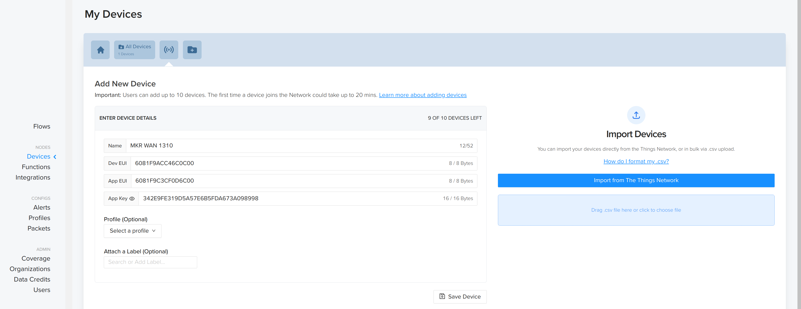

### 4. Configure the Sketch

In the Arduino [sketch](HeliumW3bstreamExample.ino), replace the following text with the values you see in the Helium Console for the device you just created:

- **YOUR_APP_EUI** : replace with the value of **App EUI** you see in Helium console for your device.
- **YOUR_APP_KEY**: replace with the value of **App Key** you see in Helium console for your device.

### 5. Create the w3bstream project

Follow the guide at [w3bstream Project Creation](https://docs.w3bstream.com/applets-development/creating-the-project) to create a w3bstream project.  
Create a new project using the **hello_world** template.

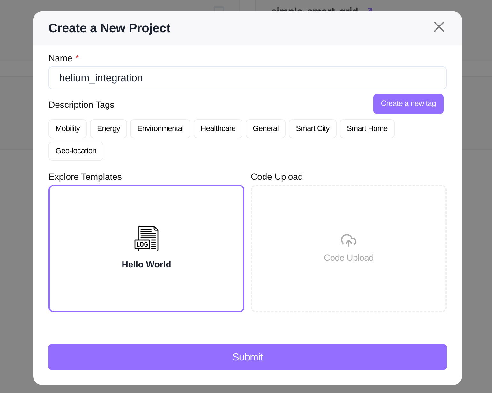

### 6. Register the device in w3bstream

Follow the guide at [Registering a Device in w3bstream](https://docs.w3bstream.com/applets-development/configuring-devices) to register your device in the w3bstream project.  
In the Arduino [sketch](HeliumW3bstreamExample.ino), replace **YOUR_DEVICE_NAME** with the name of the device you just created.

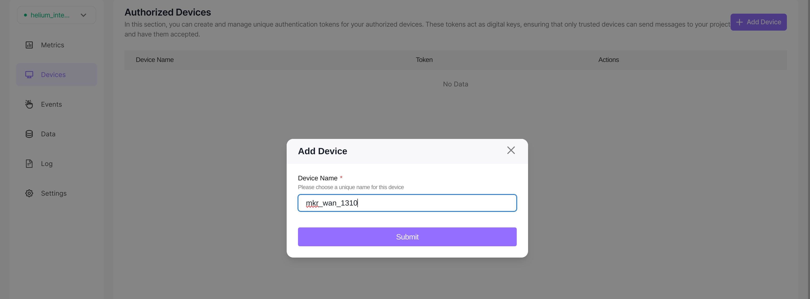

### 7. Generate a w3bstream API Key

Follow the next steps to generate your API key:  

- In w3bstream Studio, click on your wallet address in the top right corner.
- Click on **Settings**
- Add a new API key with **Event** privileges set to **Read/Write**.
- Copy the newly generated API key, you'll need to add it to yout Helium integration later.

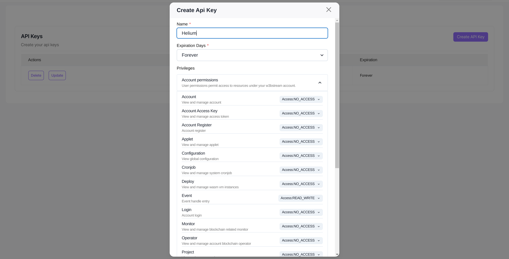

### 8. Customize the message to send (Optional)

If desired, replace the value of the `message` variable in the Arduino sketch with your own message.  

### 9. Create the decoder function (Helium Console)

Create a Custom function in Helium console. Refer to https://docs.helium.com/console/functions for details.  
Copy the following code into the *Custom script* textbox:

```js
function Decoder(bytes, port, uplink_info) {
    const { dev, msg } = JSON.parse(String.fromCharCode(...bytes));
    return { dev, msg };
}
```
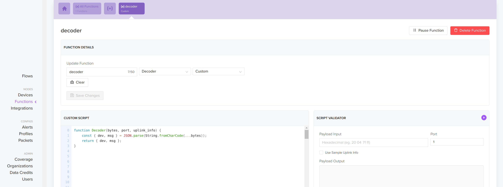

### 10. Create the HTTP Integration (Helium Console)

Create a new HTTP integration in the Helium console. Refer to https://docs.helium.com/console/integrations/http for details.  
Configure the integration as follows:  

- Set the HTTP method to **POST**
- Set the endpoint URL to the HTTP route of your w3bstream project
- Add the following HTTP header:
    - **Key**: Authorization
    - **Value**: Bearer followed by your w3bstream API key
- Add the following URL parameter:
    - **Key**: eventType
    - **Value**: DA-TA_PU-SH

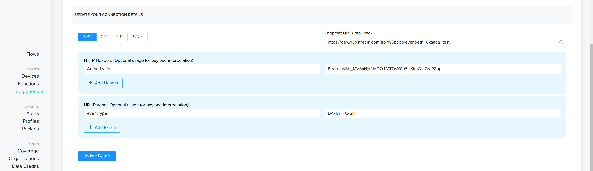

- Enter the following in **Template body**
```json
[{
  "device_id": "{{decoded.payload.dev}}",
  "event_type": "DEFAULT",
  "payload": "{{decoded.payload.msg}}"
}]
```
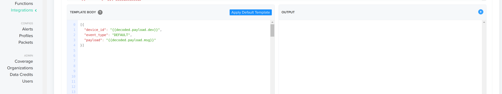

### 12. Create Helium Flow (Helium Console)

Create a new flow in the Helium console. Refer to https://docs.helium.com/console/flows/actions for details.  
Configure the flow as follows:  

- Add your device to the flow
- Add the decoder funtion to the flow, and link it to your device
- Add the http integration to your flow, and link it to the decoder function
- You should have a flow like *devide->decoder->integration*

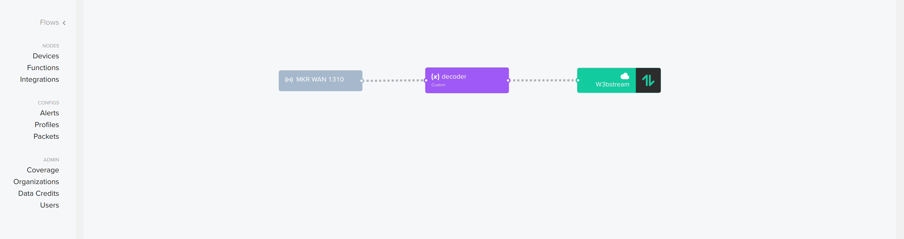

### 13. Verify Data Credits

Ensure you have enough Data Credits in your Helium account to use the network. Refer to [Data Credits Documentation](https://docs.helium.com/tokens/data-credit/) for details.

### 14. Upload and Verify

- Upload the modified Arduino sketch to your Arduino Nano MKR 1310.
- Monitor the Serial Monitor for possible errors. If there are no errors, you should see something like this:
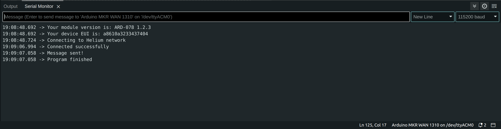
- Monitor the Helium debug console to see the device activity and optional debug information.
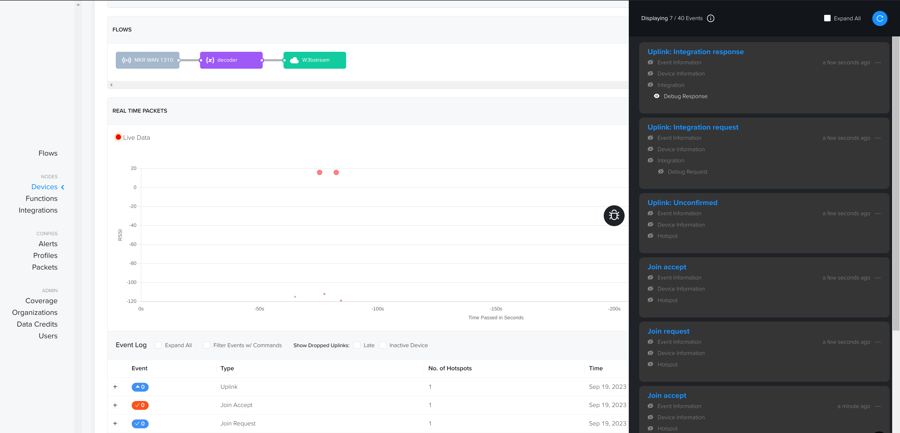
- Check the w3bstream project logs in w3bstream studio; you should see the message printed there.
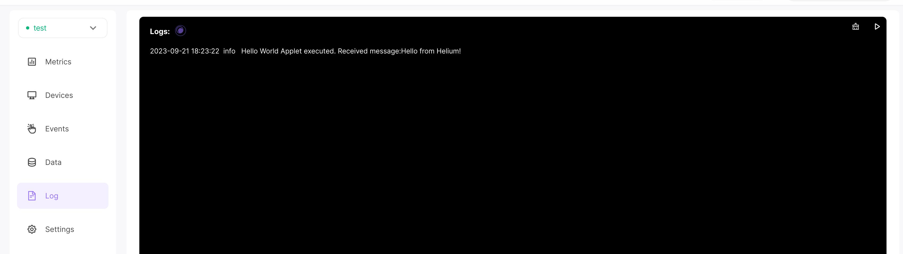

Congratulations! You have successfully integrated your Arduino Nano MKR 1310 with Helium and w3bstream. Your device can now send data to w3bstream via the Helium network.
